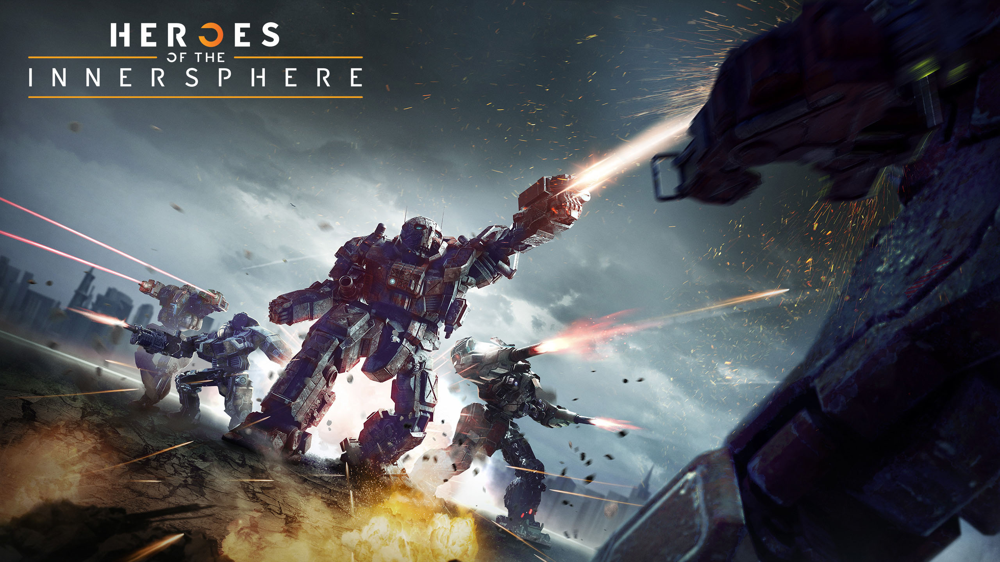
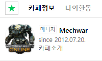
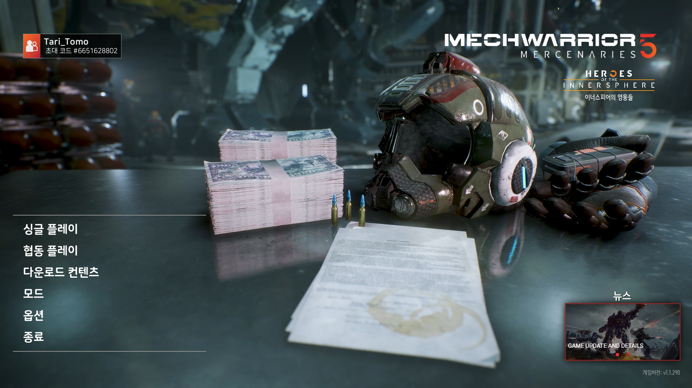
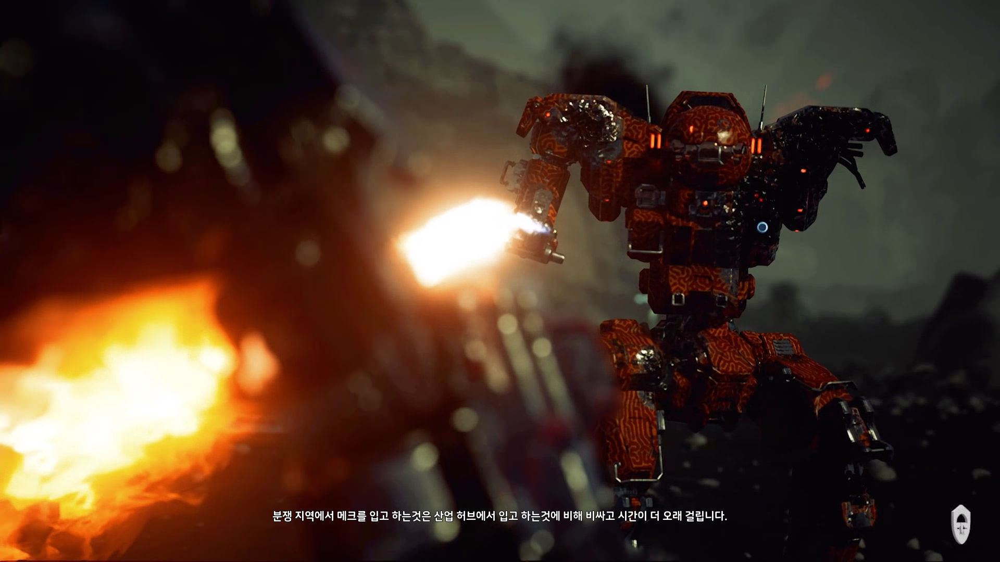
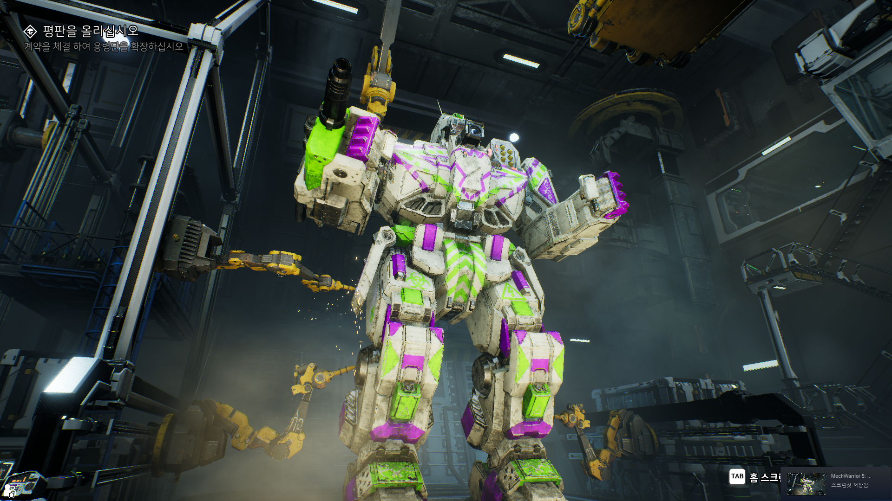
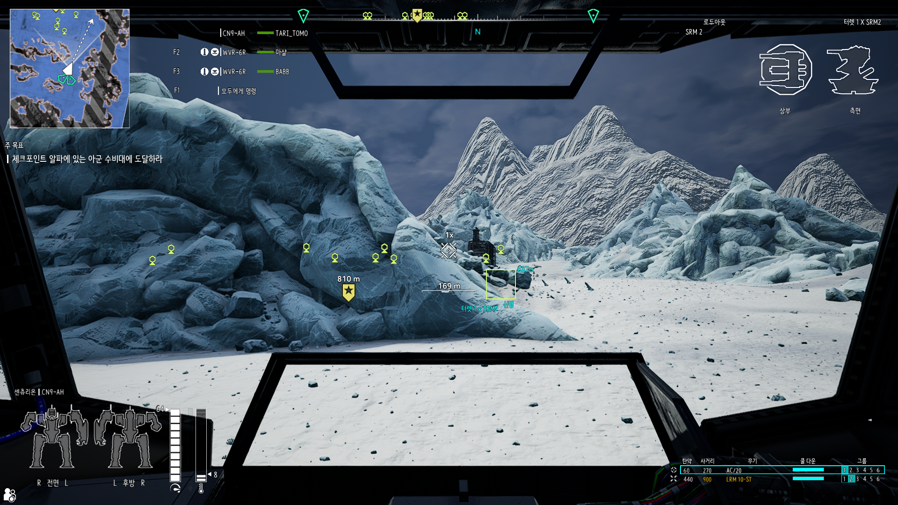
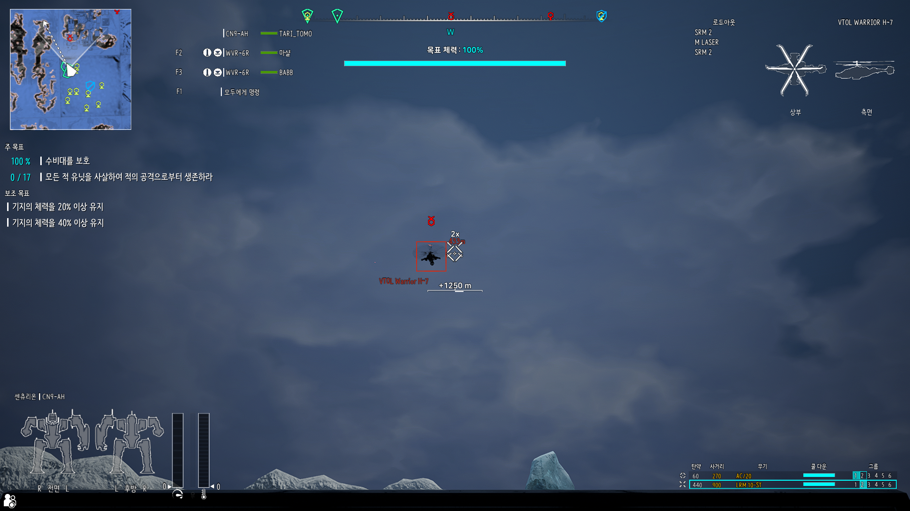
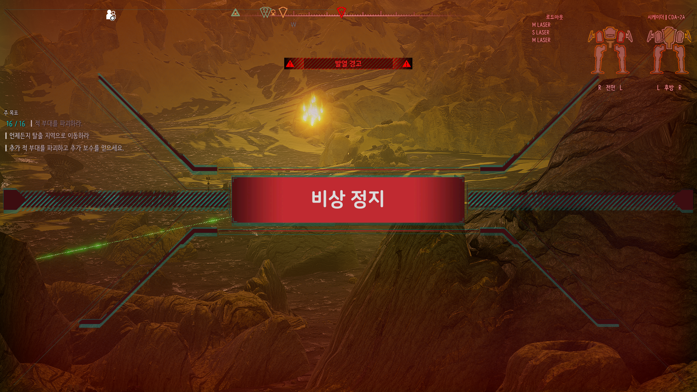
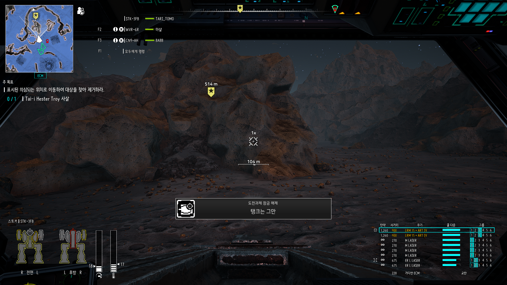

# Mechwarrior 5 Mercenaries 비공식 한글 패치

[Steam - Tari_Tomo](https://steamcommunity.com/id/Tari_Tomo/)

### 멕워리어 5 / 멕워리어 온라인 한국 커뮤니티
| 디시인사이드 배틀테크-맥워리어 갤러리 | 멕워리어 온라인 네이버 카페 |
|:-------------:|:-------------:|
|  |  |

### 멕워리어 5 / 멕워리어 온라인 한국인 스트리머
| 나미노예_우혜인 |
|:-------------:|
|  |

 

[맥워리어5 (Steam, PC)](https://store.steampowered.com/app/784080/MechWarrior_5_Mercenaries)의 비공식 한글 패치입니다. 

<!-- #### 모든 수정사항은 [여기](./version_history.md) 에서 확인이 가능합니다. -->

## ※멕워리어5 한글패치 참여방법
### [멕워리어5 한글패치 스프레드시트](https://docs.google.com/spreadsheets/d/1wsApuxcBJIi7p4p7p4AkVqx9v3-axuONpd8sKDd26Rg/edit#gid=0)
### 디스코드: https://discord.gg/c5MeTpQ8D6 에 접속하셔서 확인 부탁드립니다!

## 1. 테스트 패치 다운로드 및 적용방법
### ([「`스팀 창작마당`](https://steamcommunity.com/sharedfiles/filedetails/?id=2518884137)에서 모드를 구독하였을시 모드파일의 다운로드는 불필요합니다.)
<!-- 1. 아래 링크로 이동하여 테스트 패치 파일을 다운로드 합니다. -->
1. [Release](https://github.com/angel606k/Mechwarrior-5-Korean-Localization/releases)에 있는 최신버전의 한글패치를 다운로드 합니다. 
(※ Mechwarrior-5-Korean-Mod_<버전>.zip 파일을 다운로드 합니다.) 
(※ Source code 의 다운로드는 불필요 합니다.)
2. 맥워리어5가 설치된 디렉터리 (일반적으로 `C:\Program files\Steam\steamapps\common\MechWarrior 5 Mercenaries`)로 이동합니다.
3. 다운로드 한 모드파일 [「`Mechwarrior-5-Korean-Mod_<버전>.zip`」](https://github.com/angel606k/Mechwarrior-5-Korean-Localization/blob/master/Build/Korean%20Localization%20Mod%20V1.0.zip))을 `\MW5Mercs\Mods` 에 압축 해제합니다. (Mods 폴더가 없으시면 새 폴더를 작성 후 압축해제)
  (※ Mods 폴더 이하에 Korean 폴더가 존재하여야 정상입니다.)
4. 다운로드 한 언어파일 (Mechwarrior-5-Korean-Language_<버전>.zip)을 `\MW5Mercs\Content` 에 압축 해제합니다.
  (※ Content 폴더 이하에 Localization 폴더가 존재햐여야 정상입니다.)
5. 멕워리어5를 실행하여 MODS -> Korean_All 모드를 활성화 후 게임을 재시작합니다.
6. 재시작 후 Options -> Language 옵션을 Korea(South Korea)으로 선택하시면 언어 변경이 완료됩니다.
  (※ 한국어(북한) 언어는 번역 디버그용입니다.) 

## 2. 번역/검수 및 피드백은 어디에서 할 수 있나요?
・디시인사이드 배틀테크-맥워리어 마이너 갤러리를 참고하셔서 번역/검수에 참여하거나 피드백을 남겨주세요! 
・여러분들의 도움이 절실합니다! 
### 「게임이 버전업 됨에 따라 번역문도 추가 예정입니다.」

## 스크린샷

## License

본 프로젝트는 [MIT License](./LICENSE) 하에 제공됩니다.
